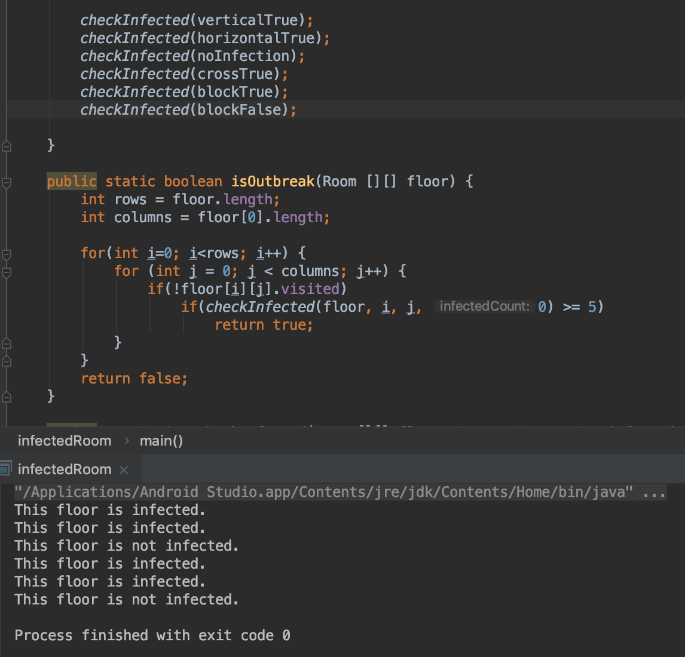

# Week2Daily1CodingTest

## occurenceTest.java
This program takes in an array of integers and aims to find out the integers with the highest occurence.
It uses a HashMap take in the integers as keys and increments the value. The highest occurence rate is saved in an int primitive.  Once all of the integer array is interated through, the HashMap is iterated through, and all the integer keys whose values are equal to the high occurence are printed.

## armstrongTest.java
This program determines whether or not an integer is an Armstrong number. The integer is iterated through one digit at a time starting from the ones digit and each digit is cubes and added to a total. After all the digits have been iterated through, the total is compared to the integer to see if it is an Armstrong number.

## infectedRoom.java
This program takes in a two-dimensional array of Room Objects and determines whether there are 5 connecting rooms that are infected. Room Objects have 2 member variables that are booleans: _isInfected_ and _visited_.

The program iterates throughout the entire 2D array and uses a recursive algorithm to find chains of infected rooms, but skips any rooms that have been visited by the recursive algorithm with the use of the _visited_ boolean.

The recursive algorithm takes in the reference to the 2D array, the coordinates of the current room being searched, and the number of infected rooms thus far as parameters. 
It initially checks if the room has been visited or if the room is infected, and it returns if the room is already visited or not infected. If the room has not been visited and is infected, then the number of found rooms is incremented by one and the algorithm checks if the limit of rooms has been reached. If the limit has not been reached, then the algorithm searches through the adjacents rooms by passing updated coordinates and infected room count to the recursive method. After all recursive methods are returned, the final total is returned to the initial call where the search continues if no chain of 5 infected rooms is found.

